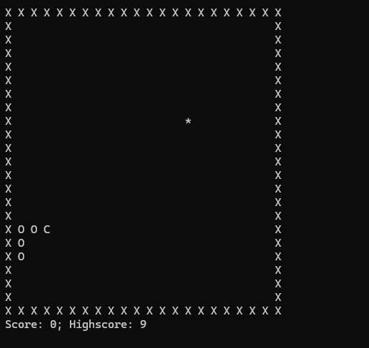

# Terminal Snake Game

A classic Snake game implemented in C for the terminal. The game loop is optimized to run in O(1) time per update.



## Building

```bash
gcc src/*.c -o snake
```

## Running

```bash
./snake
```

## Controls

- Arrow keys: Move snake
- `q`: Quit game

## Gameplay

- Eat food to grow longer
- Avoid hitting yourself
- Enable or disable game borders by setting WRAP_AROUND in config.h (0 for borders, 1 for wrap-around)
- Control the game speed by adjusting SLEEP_TIME_MS in config.h (default 32ms ~ 30FPS)